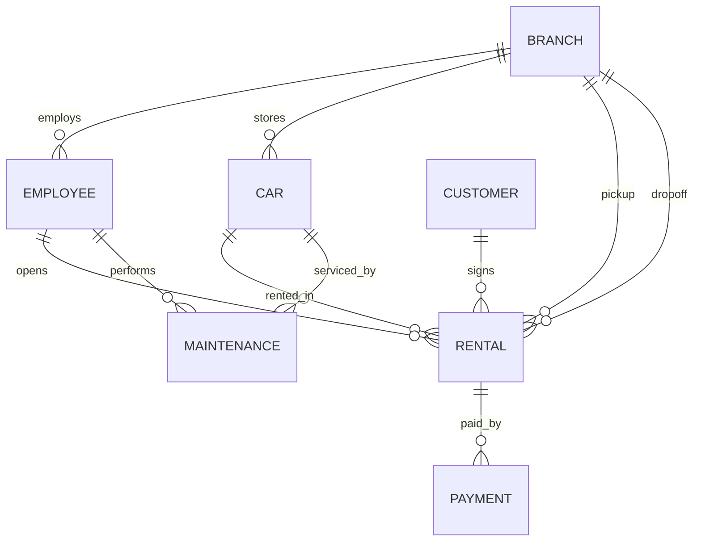

# Домашнее задание по курсу «Базы данных»
## Тема: БД фирмы по прокату автомобилей

СУБД: PostgreSQL.

Ниже отчет структурирован по технологии из методических указаний (пп. 2.1.1–2.5.6; без 2.2 и 2.3).

---

## 2.1. Инфологическое проектирование

### 2.1.1. Анализ предметной области

Организация занимается прокатом автомобилей через сеть филиалов (пунктов выдачи). Клиент выбирает автомобиль, оформляет договор аренды на период, получает авто в одном филиале и возвращает в том же или другом. Сотрудники филиала оформляют выдачу/возврат и меняют статус аренды. Оплата может поступать частями, возможны возвраты. Автомобили проходят обслуживание (ремонт/ТО) и на время обслуживания недоступны для аренды.

Важные бизнес-правила (уровень предметной области):
- Один и тот же автомобиль не может быть сдан в аренду двум клиентам на пересекающиеся периоды.
- Автомобиль, находящийся на обслуживании, нельзя выдать в аренду на пересекающийся период.
- Договор аренды имеет статусы (новый, активный, закрыт, отменен).
- Оплаты относятся к конкретному договору; оплата может быть возвратом.

Сущности (5–7 сущностей на ER-диаграмме):
- **Филиал** (Branch)
- **Сотрудник** (Employee)
- **Клиент** (Customer)
- **Автомобиль** (Car) и его **модель** (CarModel) как характеристика
- **Аренда/Договор** (Rental)
- **Платеж** (Payment)
- **Обслуживание** (Maintenance)

### 2.1.2. Анализ информационных задач и круга пользователей системы

Группы пользователей:
1) Менеджер сети (роль `cr_manager`)
   - Просмотр ключевых показателей (выручка, загрузка автопарка).
   - Контроль активных/просроченных договоров.
   - Управление справочниками и структурой данных.
2) Агент проката (роль `cr_agent`)
   - Регистрация клиентов.
   - Создание договоров аренды, изменение статусов.
   - Поиск доступных автомобилей «на сейчас».
3) Бухгалтер (роль `cr_accountant`)
   - Внесение оплат и возвратов.
   - Контроль оплат по договорам, отчет «выручка по месяцам».
4) Механик/сервис (роль `cr_mechanic`)
   - Регистрация обслуживания автомобиля и его периодов.
   - Просмотр автомобилей, находящихся на обслуживании.

Готовые запросы (представления) реализованы в скрипте (см. `car_rental.sql`):  
`v_cars`, `v_active_rentals`, `v_overdue_rentals`, `v_available_cars_now`, `v_rental_payment_net`, `v_rentals_pricing`, `v_cars_in_maintenance`, `v_revenue_by_month`, `v_customer_rental_history`, `v_car_utilization`.

### 2.1.3. Построение ER-диаграммы

ER-диаграмма (Mermaid, для вставки в отчет/конспект):

Примечание: справочные таблицы (категории авто, тип топлива и т.п.) на ER-диаграмме не отображены, т.к. они относятся к уточнению атрибутов/доменов.

---

## 2.4. Логическое проектирование реляционной БД

### 2.4.1. Преобразование ER-диаграммы в схему базы данных

Связи 1:М реализованы через внешние ключи:
- `employee.branch_id -> branch.branch_id`
- `car.current_branch_id -> branch.branch_id`
- `rental.customer_id -> customer.customer_id`
- `rental.car_id -> car.car_id`
- `rental.opened_by_employee_id -> employee.employee_id`
- `payment.rental_id -> rental.rental_id`
- `maintenance.car_id -> car.car_id`
- и т.д.

Связи М:М в итоговой схеме отсутствуют (требование выполнено).

### 2.4.2. Составление реляционных отношений (финальная схема)

Схема реализована в `car_rental.sql`:
- Справочники: `car_category`, `fuel_type`, `transmission_type`, `payment_method`, `employee_role`, `rental_status`
- Основные: `branch`, `employee`, `customer`, `car_model`, `car`, `rental`, `payment`, `maintenance`

Типы и длины подобраны по рекомендациям: короткие коды — `char`, текст — `varchar`, суммы — `numeric(p,s)`, даты/время — `date`/`timestamptz`, интервалы — `tsrange`.

### 2.4.3. Нормализация полученных отношений (до 4НФ)

Пример исходного (ненормализованного) отношения, отражающего оформление аренды:

`RENTAL_RAW(Договор, КлиентФИО, КлиентТел, КлиентПрава, АвтоНомер, Марка, Модель, Категория, Тариф, ДатаНачала, ДатаОкончания, ФилиалВыдачи, ФилиалВозврата, АгентФИО, ОплатаСумма, ОплатаМетод, ...)`

Функциональные зависимости (фрагмент):
- `АвтоНомер -> VIN, model_id, цвет, пробег, текущийФилиал, active`
- `model_id -> make, model, year, category_code, fuel_code, transmission_code, seats`
- `КлиентПрава -> данные клиента (ФИО, телефон, e-mail, даты прав)`
- `Договор -> (Клиент, Авто, периоды, тариф, статус, филиалы, агент)`
- `Оплата -> (Договор, сумма, метод, дата, refund)`

Декомпозиция до 3НФ/BCNF:
- Вынос данных о клиентах в `customer`
- Вынос данных об автомобилях в `car` и модель в `car_model`
- Вынос оплат в `payment`
- Вынос справочников в отдельные таблицы (категория, топливо, трансмиссия, метод оплаты, роли, статусы)

Проверка на многозначные зависимости (4НФ):
- В `rental` нет независимых многозначных наборов (платежи вынесены в `payment`, обслуживание — в `maintenance`).
- В `car_model` нет независимых множеств атрибутов: все атрибуты функционально зависят от ключа `model_id`.

### 2.4.4. Определение дополнительных ограничений целостности

Реализовано в скрипте:
- Непересечение периодов аренды для одного автомобиля: `EXCLUDE USING gist (car_id WITH =, planned_period WITH &&)` (кроме отмененных договоров).
- Непересечение периодов обслуживания для одного автомобиля: `EXCLUDE USING gist (car_id WITH =, service_period WITH &&)`.
- Запрет пересечения аренды и обслуживания: триггеры `trg_rental_period_not_in_maintenance` и `trg_maintenance_not_overlap_rentals`.
- Контроль корректности периодов: `CHECK(lower(range) < upper(range))`.
- Запрет выдачи неактивного автомобиля: триггер `trg_car_must_be_active`.

Некоторые правила (например, «истечение водительских прав относительно текущей даты») сознательно не реализованы через `CHECK` с `current_date` во избежание «плавающих» ограничений; при необходимости такие правила реализуются прикладной логикой или триггерами.

### 2.4.5. Описание групп пользователей и прав доступа

Роли и права реализованы в `car_rental.sql`:
- `cr_manager`: полный доступ к объектам схемы.
- `cr_agent`: работа с клиентами и договорами, чтение справочников и представлений.
- `cr_accountant`: работа с платежами и финансовыми представлениями.
- `cr_mechanic`: работа с обслуживанием и профильными представлениями.

---

## 2.5. Реализация проекта базы данных

### 2.5.1. Создание таблиц

Реализовано в `car_rental.sql` (создание схемы `car_rental` и таблиц).

### 2.5.2. Создание представлений (готовых запросов)

Реализовано 10 представлений (см. список в п. 2.1.2).

### 2.5.3. Назначение прав доступа

Реализовано через `CREATE ROLE` и `GRANT` (см. конец `car_rental.sql`).

### 2.5.4. Создание триггеров

Реализовано:
- `trg_rental_period_not_in_maintenance`: запрещает создавать/менять аренду на период, пересекающий обслуживание.
- `trg_maintenance_not_overlap_rentals`: запрещает создавать/менять обслуживание, пересекающееся с планом аренды.
- `trg_rental_set_actual_period`: при закрытии договора без `actual_period` заполняет его из `planned_period`.
- `trg_car_must_be_active`: запрещает создавать аренду по неактивному авто.

### 2.5.5. Создание индексов

Созданы индексы по внешним ключам и часто фильтруемым полям, а также составной индекс `rental(car_id, status_code)` (см. раздел `Indexes` в `car_rental.sql`).

### 2.5.6. Разработка стратегии резервного копирования

Стратегия (пример):
- Полная резервная копия ежедневно ночью.
- Инкрементные (WAL/архивация) каждый час при высокой интенсивности изменений.
- Хранить 14 ежедневных копий и 3 еженедельные (итого 17 полных точек восстановления) + журналы на тот же период.
