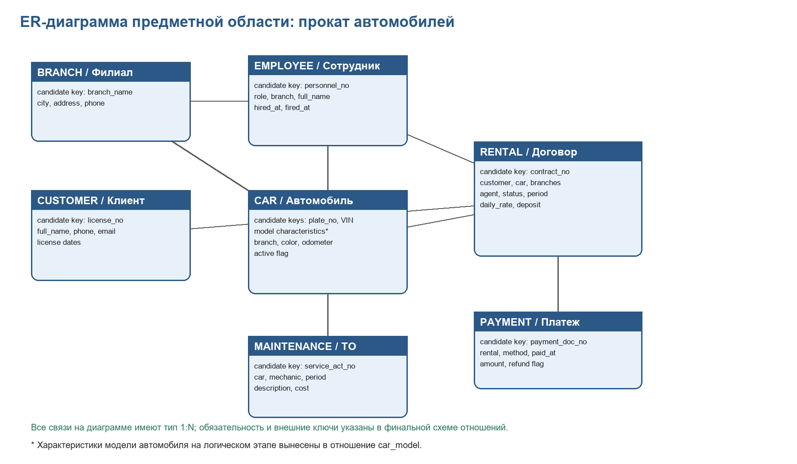

# Домашнее задание по курсу «Базы данных»
## Тема: БД фирмы по прокату автомобилей

**Исполнители:** <Фамилия Имя>, <Фамилия Имя>  
**Группа:** <номер группы>  
**Версия:** 2  
**СУБД:** PostgreSQL

> Перед отправкой заменить плейсхолдеры в титуле и имени файла на реальные фамилии, группу и номер версии.

## 2.1. Инфологическое проектирование
### 2.1.1. Анализ предметной области
Организация занимается прокатом автомобилей через сеть филиалов. Клиент выбирает автомобиль, заключает договор аренды на плановый период, получает автомобиль в филиале выдачи и возвращает его в том же или другом филиале. Сотрудники оформляют договоры, бухгалтерия регистрирует оплаты и возвраты, сервисная служба фиксирует обслуживание автомобилей.

**Основные документы предметной области:** карточка филиала, карточка сотрудника, карточка клиента, карточка автомобиля, договор аренды, платежный документ, акт обслуживания автомобиля.

**Бизнес-правила:**
- Один автомобиль не может быть сдан двум клиентам на пересекающиеся периоды.
- Автомобиль на обслуживании недоступен для аренды на пересекающийся период.
- Договор имеет статус: новый, активный, закрыт, отменен.
- Оплаты относятся к конкретному договору; платеж может быть возвратом.
- Договор может открыть только агент проката или менеджер.
- Обслуживание автомобиля выполняет сотрудник с ролью механика.

### 2.1.2. Пользователи и информационные задачи
| Роль | Пользователь | Права и задачи | Обоснование |
|---|---|---|---|
| cr_manager | Менеджер сети | Полный доступ к объектам схемы | Контроль справочников, отчетов, структуры и качества данных. |
| cr_agent | Агент проката | SELECT справочников и авто; INSERT/UPDATE customer, rental; нужные sequence | Регистрация клиентов, создание и изменение договоров. |
| cr_accountant | Бухгалтер | SELECT договоров/клиентов; INSERT/UPDATE payment; payment sequence | Учет платежей и возвратов, финансовые отчеты. |
| cr_mechanic | Механик/сервис | SELECT автомобилей; INSERT/UPDATE maintenance; maintenance sequence | Регистрация работ по обслуживанию и просмотр ТО. |

### 2.1.3. ER-диаграмма


## 2.2. Требования к операционной обстановке
База рассчитана на небольшую сеть проката: несколько филиалов, десятки сотрудников, сотни или тысячи клиентов и автомобилей. Требуется многопользовательский доступ, транзакционность и надежное восстановление после сбоя.

## 2.3. Выбор СУБД
Выбрана PostgreSQL: она поддерживает FK, транзакции, роли, представления, PL/pgSQL, GiST-индексы, exclusion constraints и диапазонные типы `tstzrange`.

## 2.4. Логическое проектирование реляционной БД
### 2.4.1. Преобразование ER-диаграммы в схему БД
Все связи 1:М реализованы внешними ключами на стороне «много». Связей М:М в итоговой схеме нет. Справочные атрибуты вынесены в отдельные отношения. Суррогатные ключи *_id введены на логическом этапе для компактных FK; на ER-диаграмме показаны потенциальные предметные ключи.

### 2.4.2. Финальная схема отношений
#### `car_category`
| Поле | Тип | Ключ/обязательность | Назначение и ограничения |
|---|---|---|---|
| category_code | CHAR(4) | PK, NOT NULL | Код категории автомобиля |
| category_name | VARCHAR(50) | NOT NULL, UNIQUE | Название категории |

#### `fuel_type`
| Поле | Тип | Ключ/обязательность | Назначение и ограничения |
|---|---|---|---|
| fuel_code | CHAR(2) | PK, NOT NULL | Код типа топлива |
| fuel_name | VARCHAR(30) | NOT NULL, UNIQUE | Название типа топлива |

#### `transmission_type`
| Поле | Тип | Ключ/обязательность | Назначение и ограничения |
|---|---|---|---|
| transmission_code | CHAR(1) | PK, NOT NULL | Код типа КПП |
| transmission_name | VARCHAR(20) | NOT NULL, UNIQUE | Название типа КПП |

#### `payment_method`
| Поле | Тип | Ключ/обязательность | Назначение и ограничения |
|---|---|---|---|
| method_code | CHAR(4) | PK, NOT NULL | Код способа оплаты |
| method_name | VARCHAR(30) | NOT NULL, UNIQUE | Название способа оплаты |

#### `employee_role`
| Поле | Тип | Ключ/обязательность | Назначение и ограничения |
|---|---|---|---|
| role_code | CHAR(4) | PK, NOT NULL | Код роли сотрудника |
| role_name | VARCHAR(50) | NOT NULL, UNIQUE | Название роли |

#### `rental_status`
| Поле | Тип | Ключ/обязательность | Назначение и ограничения |
|---|---|---|---|
| status_code | CHAR(3) | PK, NOT NULL | Код статуса договора |
| status_name | VARCHAR(30) | NOT NULL, UNIQUE | Название статуса |

#### `branch`
| Поле | Тип | Ключ/обязательность | Назначение и ограничения |
|---|---|---|---|
| branch_id | BIGSERIAL | PK | Суррогатный ключ филиала |
| branch_name | VARCHAR(100) | NOT NULL, UNIQUE | Название филиала |
| city | VARCHAR(60) | NOT NULL | Город |
| address | VARCHAR(200) | NOT NULL | Адрес |
| phone | VARCHAR(20) | NULL | Телефон |

#### `employee`
| Поле | Тип | Ключ/обязательность | Назначение и ограничения |
|---|---|---|---|
| employee_id | BIGSERIAL | PK | Суррогатный ключ сотрудника |
| branch_id | BIGINT | FK -> branch, NOT NULL | Филиал сотрудника |
| role_code | CHAR(4) | FK -> employee_role, NOT NULL | Роль сотрудника |
| full_name | VARCHAR(120) | NOT NULL | ФИО |
| phone | VARCHAR(20) | NULL | Телефон |
| hired_at | DATE | NOT NULL | Дата приема |
| fired_at | DATE | NULL, CHECK | Дата увольнения не раньше приема |

#### `customer`
| Поле | Тип | Ключ/обязательность | Назначение и ограничения |
|---|---|---|---|
| customer_id | BIGSERIAL | PK | Суррогатный ключ клиента |
| full_name | VARCHAR(120) | NOT NULL | ФИО |
| phone | VARCHAR(20) | NOT NULL | Телефон |
| email | VARCHAR(254) | NULL, CHECK | E-mail содержит @ |
| birth_date | DATE | NULL | Дата рождения |
| driver_license_no | VARCHAR(32) | NOT NULL, UNIQUE | Номер водительского удостоверения |
| driver_license_issued | DATE | NULL | Дата выдачи прав |
| driver_license_expires | DATE | NULL, CHECK | Дата окончания прав |

#### `car_model`
| Поле | Тип | Ключ/обязательность | Назначение и ограничения |
|---|---|---|---|
| model_id | BIGSERIAL | PK | Суррогатный ключ модели |
| make | VARCHAR(40) | NOT NULL | Марка |
| model | VARCHAR(60) | NOT NULL | Модель |
| year | SMALLINT | NOT NULL, CHECK | Год выпуска модели |
| category_code | CHAR(4) | FK -> car_category, NOT NULL | Категория |
| fuel_code | CHAR(2) | FK -> fuel_type, NOT NULL | Тип топлива |
| transmission_code | CHAR(1) | FK -> transmission_type, NOT NULL | Тип КПП |
| seats | SMALLINT | NOT NULL, CHECK | Количество мест |
| UNIQUE | (make, model, year, category_code, fuel_code, transmission_code) | UNIQUE | Естественная уникальность комплектации |

#### `car`
| Поле | Тип | Ключ/обязательность | Назначение и ограничения |
|---|---|---|---|
| car_id | BIGSERIAL | PK | Суррогатный ключ автомобиля |
| model_id | BIGINT | FK -> car_model, NOT NULL | Модель |
| current_branch_id | BIGINT | FK -> branch, NOT NULL | Текущий филиал |
| plate_no | VARCHAR(15) | NOT NULL, UNIQUE | Госномер |
| vin | CHAR(17) | NOT NULL, UNIQUE, CHECK | VIN |
| color | VARCHAR(30) | NULL | Цвет |
| odometer_km | INTEGER | NOT NULL, CHECK | Пробег неотрицательный |
| active | BOOLEAN | NOT NULL | Можно ли сдавать автомобиль |

#### `rental`
| Поле | Тип | Ключ/обязательность | Назначение и ограничения |
|---|---|---|---|
| rental_id | BIGSERIAL | PK | Суррогатный ключ договора |
| customer_id | BIGINT | FK -> customer, NOT NULL | Клиент |
| car_id | BIGINT | FK -> car, NOT NULL | Автомобиль |
| pickup_branch_id | BIGINT | FK -> branch, NOT NULL | Филиал выдачи |
| dropoff_branch_id | BIGINT | FK -> branch, NOT NULL | Филиал возврата |
| opened_by_employee_id | BIGINT | FK -> employee, NOT NULL | Агент, открывший договор |
| status_code | CHAR(3) | FK -> rental_status, NOT NULL | Статус договора |
| planned_period | TSTZRANGE | NOT NULL, CHECK, EXCLUDE | Плановый период аренды |
| actual_period | TSTZRANGE | NULL, CHECK | Фактический период |
| daily_rate | NUMERIC(10,2) | NOT NULL, CHECK | Суточный тариф > 0 |
| deposit_amount | NUMERIC(10,2) | NOT NULL, CHECK | Залог >= 0 |
| notes | VARCHAR(500) | NULL | Примечания |

#### `payment`
| Поле | Тип | Ключ/обязательность | Назначение и ограничения |
|---|---|---|---|
| payment_id | BIGSERIAL | PK | Суррогатный ключ платежа |
| rental_id | BIGINT | FK -> rental, NOT NULL | Договор |
| method_code | CHAR(4) | FK -> payment_method, NOT NULL | Способ оплаты |
| paid_at | TIMESTAMPTZ | NOT NULL | Дата и время платежа |
| amount | NUMERIC(12,2) | NOT NULL, CHECK | Сумма > 0 |
| is_refund | BOOLEAN | NOT NULL | Признак возврата |

#### `maintenance`
| Поле | Тип | Ключ/обязательность | Назначение и ограничения |
|---|---|---|---|
| maintenance_id | BIGSERIAL | PK | Суррогатный ключ обслуживания |
| car_id | BIGINT | FK -> car, NOT NULL | Автомобиль |
| performed_by_employee_id | BIGINT | FK -> employee, NULL | Механик |
| service_period | TSTZRANGE | NOT NULL, CHECK, EXCLUDE | Период обслуживания |
| odometer_km | INTEGER | NULL, CHECK | Пробег на момент ТО |
| description | VARCHAR(400) | NOT NULL | Описание работ |
| cost_amount | NUMERIC(12,2) | NULL, CHECK | Стоимость >= 0 |

### 2.4.3. Нормализация до 4НФ
`RENTAL_RAW(Договор, КлиентФИО, КлиентТелефон, КлиентПрава, АвтоНомер, VIN, Марка, Модель, Категория, Топливо, КПП, ФилиалВыдачи, ФилиалВозврата, Агент, Статус, Период, Тариф, ПлатежСумма, ПлатежМетод, ТОПериод, ТООписание, ...)`

Функциональные зависимости: `driver_license_no -> данные клиента`, `plate_no -> данные автомобиля`, `model_id -> характеристики модели`, `rental_id -> данные договора`, `payment_id -> платеж`, `maintenance_id -> обслуживание`.

1НФ достигается атомарностью атрибутов и выносом повторяющихся платежей/ТО. 2НФ выполняется, так как неключевые атрибуты зависят от полного ключа. 3НФ/BCNF достигается выносом клиента, автомобиля, модели, справочников, платежей и обслуживания. 4НФ выполняется, потому что независимые многозначные факты не хранятся в одном отношении.

### 2.4.4. Дополнительные ограничения целостности
| Ограничение | Реализация | Комментарий |
|---|---|---|
| Непересечение аренд одного автомобиля | EXCLUDE USING gist по car_id и planned_period | Отмененные договоры CNL не блокируют период. |
| Непересечение обслуживаний одного автомобиля | EXCLUDE USING gist по car_id и service_period | Не позволяет завести два ТО на один период. |
| Аренда не пересекается с обслуживанием | Два триггера + pg_advisory_xact_lock | Проверка сериализуется по car_id. |
| Неактивный автомобиль нельзя сдавать | trg_car_must_be_active | Проверка при INSERT и UPDATE для NEW/ACT. |
| Права клиента действуют на период аренды | trg_customer_license_valid_for_rental | Проверка относительно planned_period, без CHECK от current_date. |
| Договор открывает агент или менеджер | trg_rental_opened_by_agent_or_manager | ACCT/MECH не могут быть opened_by_employee_id. |
| Обслуживание выполняет механик | trg_maintenance_performed_by_mechanic | Если механик указан, роль должна быть MECH. |
| Положительные суммы и корректные даты | CHECK constraints | Простые ОЦ реализованы без лишних триггеров. |

### 2.4.5. Права доступа
| Роль | Пользователь | Права | Обоснование |
|---|---|---|---|
| cr_manager | Менеджер сети | Полный доступ к объектам схемы | Контроль справочников, отчетов, структуры и качества данных. |
| cr_agent | Агент проката | SELECT справочников и авто; INSERT/UPDATE customer, rental; нужные sequence | Регистрация клиентов, создание и изменение договоров. |
| cr_accountant | Бухгалтер | SELECT договоров/клиентов; INSERT/UPDATE payment; payment sequence | Учет платежей и возвратов, финансовые отчеты. |
| cr_mechanic | Механик/сервис | SELECT автомобилей; INSERT/UPDATE maintenance; maintenance sequence | Регистрация работ по обслуживанию и просмотр ТО. |

## 2.5. Реализация проекта БД
### 2.5.1. Таблицы
Таблицы, ключи, CHECK-ограничения и справочники реализованы в `car_rental.sql`. Заполнение данными выполнено только для справочников.

### 2.5.2. Представления
| Представление | Назначение |
|---|---|
| v_cars | Карточка автомобиля с моделью, категорией, филиалом и признаками доступности. |
| v_active_rentals | Активные и новые договоры для агента и менеджера. |
| v_overdue_rentals | Договоры, по которым плановый срок уже прошел, но статус еще активный/новый. |
| v_available_cars_now | Автомобили, доступные в текущий момент. |
| v_rental_payment_net | Сальдо платежей по договору с учетом возвратов. |
| v_rentals_pricing | Расчет плановых дней аренды, стоимости и оплаченной суммы. |
| v_cars_in_maintenance | Автомобили, находящиеся на обслуживании сейчас. |
| v_revenue_by_month | Выручка по месяцам по данным платежей. |
| v_customer_rental_history | История договоров клиента. |
| v_car_utilization | Плановая загрузка автомобиля в днях. |

### 2.5.3. Назначение прав доступа
Права назначаются через `CREATE ROLE` и `GRANT`; доступ к sequence у обычных ролей точечный.

### 2.5.4. Триггеры, процедуры и функции
Реализованы функции: `trg_rental_period_not_in_maintenance`, `trg_maintenance_not_overlap_rentals`, `trg_rental_set_actual_period`, `trg_car_must_be_active`, `trg_customer_license_valid_for_rental`, `trg_rental_opened_by_agent_or_manager`, `trg_maintenance_performed_by_mechanic`.

### 2.5.5. Индексы
Созданы индексы по всем внешним ключам, по дате платежа и составной индекс `rental(car_id, status_code)`. Индексы PK/UNIQUE не дублируются.

### 2.5.6. Резервное копирование
Полная резервная копия выполняется ежедневно ночью. При активной эксплуатации включается WAL-архивация. Хранить 14 ежедневных и 3 еженедельные полные копии, всего 17 точек восстановления.

## Приложение А. Проверка работоспособности
Выполнить `car_rental.sql`, затем `smoke_tests.sql`. Ожидаемые ошибочные вставки должны быть отклонены.

```bash
psql -d <database> -f car_rental.sql
psql -d <database> -f smoke_tests.sql
```

## KPI готовности v2
| Критерий | Вес | Балл v2 | Комментарий |
|---|---:|---:|---|
| Формат сдачи | 10 | 8 | Создан DOCX v2; осталось заменить плейсхолдеры фамилий/группы. |
| Инфологическое проектирование | 15 | 14 | Есть описание ПрО, документы, пользователи, ER-диаграмма и сущности. |
| Логическая схема и нормализация | 25 | 23 | Добавлены отношения с типами, ключами, ФЗ и нормализация до 4НФ. |
| Ограничения целостности | 15 | 14 | CHECK, FK, EXCLUDE и триггеры; конкурентные проверки усилены advisory lock. |
| Физическая реализация SQL | 15 | 13 | Скрипт расширен; нужен финальный прогон в живом PostgreSQL. |
| Представления и индексы | 10 | 10 | 10 представлений и индексы по всем FK + составной индекс. |
| Права и резервное копирование | 10 | 9 | Права стали точечнее, стратегия РК с числом копий описана. |
| **Итого** | **100** | **91** | Финальный прогон в PostgreSQL нужен для закрытия технического риска. |
