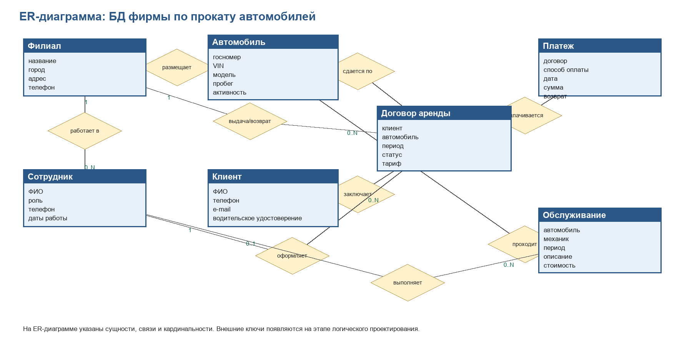

# Домашнее задание по курсу «Базы данных»
## Тема: БД фирмы по прокату автомобилей

**Исполнители:** ______________________________  
**Группа:** __________  
**СУБД:** PostgreSQL

## 2.1. Инфологическое проектирование
### 2.1.1. Анализ предметной области
Фирма оказывает услуги краткосрочного проката автомобилей через сеть филиалов. Клиент обращается в пункт проката, выбирает доступный автомобиль, заключает договор аренды, получает автомобиль в филиале выдачи и возвращает его в согласованный филиал. Оплата может быть внесена одним или несколькими платежами; при возврате средств платеж фиксируется как возврат.

Автомобили могут временно выводиться из проката для технического обслуживания. На период обслуживания автомобиль не должен быть доступен для заключения новых договоров. Сотрудники имеют разные обязанности: агент оформляет договоры, бухгалтер регистрирует платежи, механик ведет обслуживание, менеджер управляет справочниками и составом автопарка.

Документы предметной области: карточка филиала, карточка сотрудника, карточка клиента, карточка автомобиля, договор аренды, платежный документ, акт обслуживания автомобиля.

### 2.1.2. Сущности и атрибуты
| Сущность | Основные атрибуты |
|---|---|
| Филиал | название, город, адрес, телефон |
| Сотрудник | ФИО, роль, телефон, даты работы |
| Клиент | ФИО, телефон, e-mail, водительское удостоверение |
| Автомобиль | госномер, VIN, модель, пробег, активность |
| Договор аренды | клиент, автомобиль, период, статус, тариф |
| Платеж | договор, способ оплаты, дата, сумма, возврат |
| Обслуживание | автомобиль, механик, период, описание, стоимость |

### 2.1.3. Связи предметной области
| Сущность 1 | Связь | Сущность 2 | Кардинальность |
|---|---|---|---|
| Филиал | работает в | Сотрудник | 1 : 0..N |
| Филиал | размещает | Автомобиль | 1 : 0..N |
| Клиент | заключает | Договор аренды | 1 : 0..N |
| Автомобиль | сдается по | Договор аренды | 1 : 0..N |
| Сотрудник | оформляет | Договор аренды | 1 : 0..N |
| Договор аренды | оплачивается | Платеж | 1 : 0..N |
| Автомобиль | проходит | Обслуживание | 1 : 0..N |
| Сотрудник | выполняет | Обслуживание | 0..1 : 0..N |
| Филиал | выдача/возврат | Договор аренды | 1 : 0..N |

### 2.1.4. ER-диаграмма


Исходный файл диаграммы для редактирования в diagrams.net: `ER_diagram.drawio`.

### 2.1.5. Пользователи и задачи
| Данные | Ответственный пользователь | Операции | Комментарий |
|---|---|---|---|
| Справочники | менеджер | C/R/U | значения не удаляются, при необходимости заменяются или перестают использоваться |
| Филиалы | менеджер | C/R/U | удаление не используется, чтобы не потерять историю договоров |
| Сотрудники | менеджер | C/R/U | увольнение фиксируется датой fired_at |
| Клиенты | агент проката | C/R/U | удаление заменяется исправлением данных |
| Модели и автомобили | менеджер | C/R/U | автомобиль выводится из работы через active=false |
| Договоры аренды | агент проката | C/R/U | удаление заменяется статусом 'отменен' |
| Платежи | бухгалтер | C/R/U | возврат фиксируется отдельным платежом с признаком is_refund |
| Обслуживание | механик | C/R/U | ошибочные записи исправляются, физическое удаление не предполагается |

## 2.2. Требования к операционной обстановке
Учебная версия рассчитана на небольшую сеть проката: несколько филиалов, десятки сотрудников, сотни клиентов и автомобилей. Требуется многопользовательская СУБД, поддержка транзакций, внешних ключей, представлений, ролей и триггеров.

## 2.3. Выбор СУБД
Выбрана PostgreSQL. В схеме используются в основном базовые средства реляционных СУБД: таблицы, первичные и внешние ключи, CHECK, представления, индексы и права доступа. Синтаксис триггеров и ролей записан для PostgreSQL как выбранной СУБД.

## 2.4. Логическое проектирование реляционной БД
### 2.4.1. Преобразование ER-диаграммы в схему БД
| Связь ER | Реализация в схеме | Пояснение |
|---|---|---|
| Филиал - Сотрудник | employee.branch_id -> branch.branch_id | один филиал может иметь много сотрудников |
| Филиал - Автомобиль | car.current_branch_id -> branch.branch_id | текущий филиал автомобиля |
| Клиент - Договор | rental.customer_id -> customer.customer_id | клиент может иметь много договоров |
| Автомобиль - Договор | rental.car_id -> car.car_id | автомобиль участвует во многих договорах во времени |
| Сотрудник - Договор | rental.opened_by_employee_id -> employee.employee_id | договор оформляет сотрудник |
| Договор - Платеж | payment.rental_id -> rental.rental_id | у договора может быть несколько платежей |
| Автомобиль - Обслуживание | maintenance.car_id -> car.car_id | у автомобиля может быть много обслуживаний |
| Сотрудник - Обслуживание | maintenance.performed_by_employee_id -> employee.employee_id | обслуживание выполняет механик |

### 2.4.2. Финальная схема отношений
| Отношение | Ключевые поля | Ключи | Назначение |
|---|---|---|---|
| car_category | category_name VARCHAR(50) | PK | категория автомобиля |
| fuel_type | fuel_name VARCHAR(30) | PK | тип топлива |
| transmission_type | transmission_name VARCHAR(20) | PK | тип коробки передач |
| payment_method | method_name VARCHAR(30) | PK | способ оплаты |
| employee_role | role_name VARCHAR(50) | PK | роль сотрудника |
| rental_status | status_name VARCHAR(30) | PK | статус договора |
| branch | branch_id BIGSERIAL | PK | филиал проката |
| employee | employee_id BIGSERIAL, branch_id, role_name | PK, FK | сотрудник филиала |
| customer | customer_id BIGSERIAL, driver_license_no | PK, UNIQUE | клиент |
| car_model | model_id BIGSERIAL, category_name, fuel_name, transmission_name | PK, FK | модель автомобиля |
| car | car_id BIGSERIAL, model_id, current_branch_id, plate_no, vin | PK, FK, UNIQUE | автомобиль |
| rental | rental_id BIGSERIAL, customer_id, car_id, branches, employee, status | PK, FK | договор аренды |
| payment | payment_id BIGSERIAL, rental_id, method_name | PK, FK | платеж по договору |
| maintenance | maintenance_id BIGSERIAL, car_id, performed_by_employee_id | PK, FK | обслуживание автомобиля |

### 2.4.3. Нормализация отношений
Исходное ненормализованное отношение для договора аренды можно представить так:

`RENTAL_RAW(Договор, КлиентФИО, КлиентТелефон, КлиентПрава, АвтоНомер, VIN, Марка, Модель, Категория, Топливо, КПП, ФилиалВыдачи, ФилиалВозврата, АгентФИО, Статус, Период, Тариф, ПлатежСумма, ПлатежМетод, ТОПериод, ТООписание, ...)`

1НФ: повторяющиеся группы платежей и обслуживаний вынесены в отдельные отношения `payment` и `maintenance`; значения атрибутов сделаны атомарными.

2НФ: данные клиента, автомобиля, филиала и сотрудника не зависят от договора частично; они вынесены в `customer`, `car`, `branch`, `employee`.

3НФ/BCNF: характеристики модели автомобиля зависят от модели, а не от конкретного автомобиля, поэтому выделено отношение `car_model`; значения с ограниченным списком вынесены в справочники.

4НФ: независимые многозначные факты не хранятся в одном отношении: платежи договора хранятся в `payment`, обслуживания автомобиля - в `maintenance`.

### 2.4.4. Дополнительные ограничения целостности
| Ограничение | Реализация |
|---|---|
| Плановый период аренды корректен | CHECK(planned_end > planned_start) |
| Автомобиль не может иметь две пересекающиеся аренды | trg_rental_period_check |
| Аренда не должна пересекаться с обслуживанием | trg_rental_period_check, trg_maintenance_period_check |
| Неактивный автомобиль нельзя сдавать | trg_car_must_be_active |
| Права клиента должны действовать на период аренды | trg_customer_license_valid |
| Договор открывает агент или менеджер | trg_rental_opened_by_agent_or_manager |
| Обслуживание выполняет механик | trg_maintenance_performed_by_mechanic |
| Платеж нельзя внести по отмененному договору | trg_payment_not_for_canceled_rental |

### 2.4.5. Права доступа
Физическое удаление рабочих данных обычными пользователями не используется: договор отменяется статусом, автомобиль выводится из проката признаком `active`, сотрудник закрывается датой увольнения. Это сохраняет историю операций.
| Роль | Назначение | Основные права |
|---|---|---|
| cr_manager | менеджер сети | полный доступ к таблицам и справочникам |
| cr_agent | агент проката | работа с клиентами и договорами, чтение автомобилей и справочников |
| cr_accountant | бухгалтер | работа с платежами и финансовыми представлениями |
| cr_mechanic | механик | работа с обслуживанием автомобилей |

## 2.5. Реализация проекта БД
### 2.5.1. Создание таблиц
Создание таблиц, первичных и внешних ключей, ограничений CHECK и справочников приведено в `car_rental.sql`. Заполнение данными выполнено только для справочников.

### 2.5.2. Создание представлений
| Представление | Назначение |
|---|---|
| v_cars | автомобили с характеристиками модели и текущим филиалом |
| v_active_rentals | новые и активные договоры аренды |
| v_overdue_rentals | договоры, у которых истек плановый срок |
| v_available_cars_now | автомобили, доступные в текущий момент |
| v_rental_payment_net | сальдо оплат и возвратов по договору |
| v_rentals_pricing | плановая стоимость договора и оплаченная сумма |
| v_cars_in_maintenance | автомобили, находящиеся на обслуживании |
| v_revenue_by_month | выручка по месяцам |
| v_customer_rental_history | история договоров клиента |
| v_car_utilization | плановая загрузка автомобиля |

Представления используются для чтения и отчетов. Изменение данных выполняется через базовые таблицы, поэтому права INSERT/UPDATE/DELETE на необновляемые представления не назначаются.

### 2.5.3. Назначение прав доступа
В скрипте создаются роли `cr_manager`, `cr_agent`, `cr_accountant`, `cr_mechanic` и назначаются права, соответствующие задачам пользователей.

### 2.5.4. Создание триггеров
Триггеры проверяют пересечение периодов аренды и обслуживания, активность автомобиля, срок действия водительского удостоверения, роль сотрудника при оформлении договора и обслуживании, а также запрет платежа по отмененному договору.

### 2.5.5. Создание индексов
Созданы индексы по внешним ключам и по полям, которые используются для поиска периодов аренды, обслуживания и платежей. Индексы по первичным и уникальным ключам отдельно не создаются, так как СУБД создает их автоматически.

### 2.5.6. Стратегия резервного копирования
Для учебной системы достаточно полного резервного копирования один раз в день после окончания рабочего дня. Хранить 14 ежедневных копий и 3 еженедельные копии. При увеличении нагрузки можно добавить архивирование журнала транзакций средствами СУБД.

### 2.5.7. Ограничения учебной реализации
В проекте не реализованы интеграция с платежными системами, расчет штрафов за просрочку, автоматическое изменение филиала автомобиля после закрытия договора и промышленная защита от всех параллельных массовых изменений. Эти функции можно добавить на следующем этапе развития системы.

## Приложение. Проверка работоспособности
Для проверки можно выполнить два скрипта:

```bash
psql -d <database> -f car_rental.sql
psql -d <database> -f smoke_tests.sql
```
